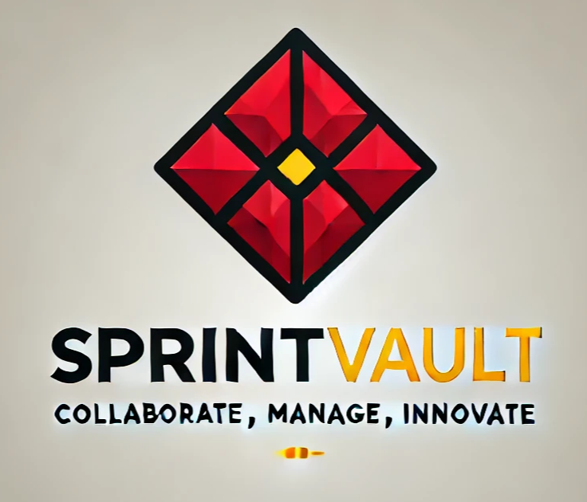

 

# SprintHub - Agile Project Management Tool
Sprint Hub is a powerful Agile project management tool designed to streamline your software development projects. With features tailored for Scrum, Kanban, and Agile methodologies, Sprint Hub empowers teams to plan, execute, and optimize their projects with ease.

## Introduction
### Purpose of the project:
The purpose of this Agile Project Management Tool project is to streamline and enhance the software development process, enabling teams to adopt Agile methodologies effectively, collaborate efficiently, and continuously improve their projects while ensuring data security and customization flexibility. This includes supporting Agile methodologies, facilitating collaboration, tracking progress, ensuring data security, and promoting customization to meet the specific needs of your projects.

### Scope of the project:
The scope of your Agile Project Management Tool project includes:
1.	Designing, developing, and deploying the software application.
2.	Creating a user interface for easy interaction with the tool.
3.	Implementing all the specified features and functionality, including user management, project management, team management, sprint planning, task and user story management, communication and collaboration features, meeting management, reporting and analytics, security measures, customization options, and data integrity features.
4.	Implementing data storage and management capabilities for all relevant entities and relationships described in the entity-relationship model.
5.	Enabling scalability and performance optimization to accommodate potential growth and increased usage.
6.	Ensuring the security and privacy of user data through appropriate measures.

In summary, the scope of your Agile Project Management Tool project covers the entire development and deployment process, including all specified features and functionalities, to create a fully functional and effective tool for managing Agile software development projects.

## Project Description
### Project Overview:
The Agile Project Management Tool project aims to develop a web-based software application that facilitates the efficient management of software development projects using Agile methodologies. This tool will provide a centralized platform for project managers, team members, and stakeholders to collaborate, plan, track progress, and continuously improve their software development efforts.

### Major project functionalities:
The major system features:\
•	User Registration and Authentication: Users can register and log in securely.\
•	Project Creation and Management: Project managers can create, edit, and manage projects.\
•	Sprint Planning: Project managers can plan sprints with defined goals.\
•	Comments and Attachments: Users can discuss and share files within tasks and stories.\
•	Meetings Management: Users can schedule and document key project meetings.\
•	Task and User Story Management: Users can create, assign, and track tasks and user stories.\

 
